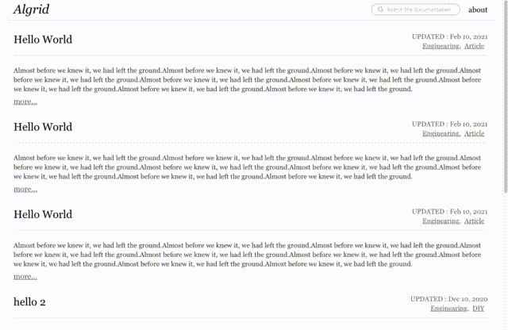

# Gridsome Starter algrid

Algrid is a simple starter for creating blogs using Gridsome.



## Features

- Algolia
- Infinite Scroll
- Draft Posts
- Tag Page
- Content from markdown.
- Stylesheet build using Stylus.
- Vuex

## Installation

```
git clone https://github.com/gollowars/gridsome-starter-algrid.git
cd algrid
yarn install
```

## Setup Algolia

add a credential file to a .env file

```
// DEVELOPING: .env.development
// BUILDING: .env.production

GRIDSOME_ALGOLIA_APP_ID=XXXXXXXX
GRIDSOME_ALGOLIA_INDEX_NAME=XXXXXXXX
GRIDSOME_ALGOLIA_SEARCH_KEY=XXXXXXXX
ALGOLIA_ADMIN_KEY=XXXXXXXX
```

algrid used [gridsome-plugin-algolia](https://gridsome.org/plugins/gridsome-plugin-algolia)
check the page.

## Setup blog

check ./data/config.yml
you can add a site information here.

```
sitename: BLOGNAME
pathPrefix: /
protocol: https
domain: example.me
url: https://example.me
titleTemplate: "%s - BLOGNAME"
meta:
  keywords: sample, sample
  description: "algrid is a simple starter for creating blogs using Gridsome."

about:
  title: |-
    About
  contents: |-
    <h2>hello</h2>
    <p>"algrid is a simple starter for creating blogs using Gridsome."</p>


```

## Develop

1. `yarn dev`

## Preview

1. `yarn preview`
